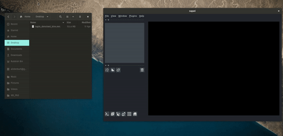

# napari-mrcfile-reader

Read MRC format image files into napari using the [mrcfile] package from [CCP-EM]

----------------------------------

----------------------------------

This [napari] plugin was generated with [Cookiecutter] using with [@napari]'s [cookiecutter-napari-plugin] template.

## Installation

You can install `napari-mrcfile-reader` via [pip]:

    pip install napari-mrcfile-reader

## Contributing

Contributions are very welcome. Tests can be run with [tox], please ensure
the coverage at least stays the same before you submit a pull request.

## License

Distributed under the terms of the [BSD-3] license,
"napari-mrcfile-reader" is free and open source software

## Issues

If you encounter any problems, please [file an issue] along with a detailed description.

[CCP-EM]: https://www.ccpem.ac.uk/
[mrcfile]: https://github.com/ccpem/mrcfile
[napari]: https://github.com/napari/napari
[Cookiecutter]: https://github.com/audreyr/cookiecutter
[@napari]: https://github.com/napari
[MIT]: http://opensource.org/licenses/MIT
[BSD-3]: http://opensource.org/licenses/BSD-3-Clause
[GNU GPL v3.0]: http://www.gnu.org/licenses/gpl-3.0.txt
[GNU LGPL v3.0]: http://www.gnu.org/licenses/lgpl-3.0.txt
[Apache Software License 2.0]: http://www.apache.org/licenses/LICENSE-2.0
[Mozilla Public License 2.0]: https://www.mozilla.org/media/MPL/2.0/index.txt
[cookiecutter-napari-plugin]: https://github.com/napari/cookiecutter-napari-plugin
[file an issue]: https://github.com/alisterburt/napari-mrcfile-reader/issues
[napari]: https://github.com/napari/napari
[tox]: https://tox.readthedocs.io/en/latest/
[pip]: https://pypi.org/project/pip/
[PyPI]: https://pypi.org/